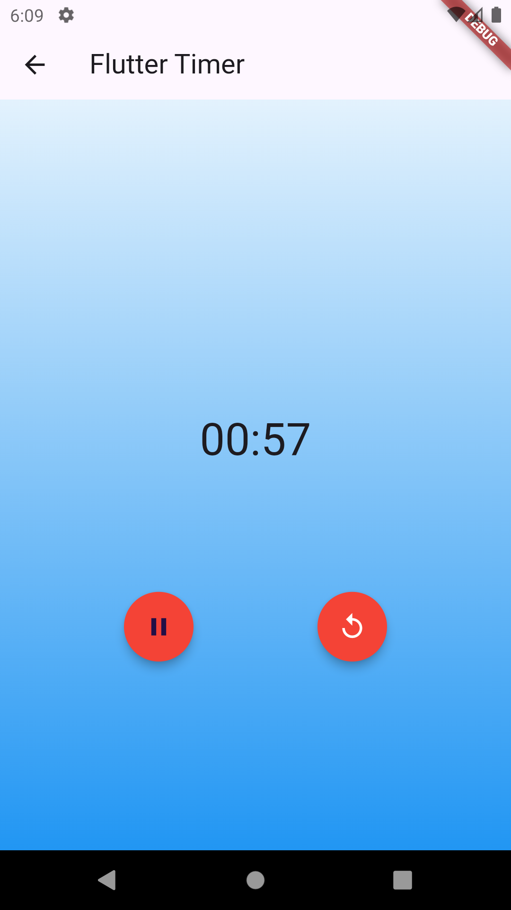
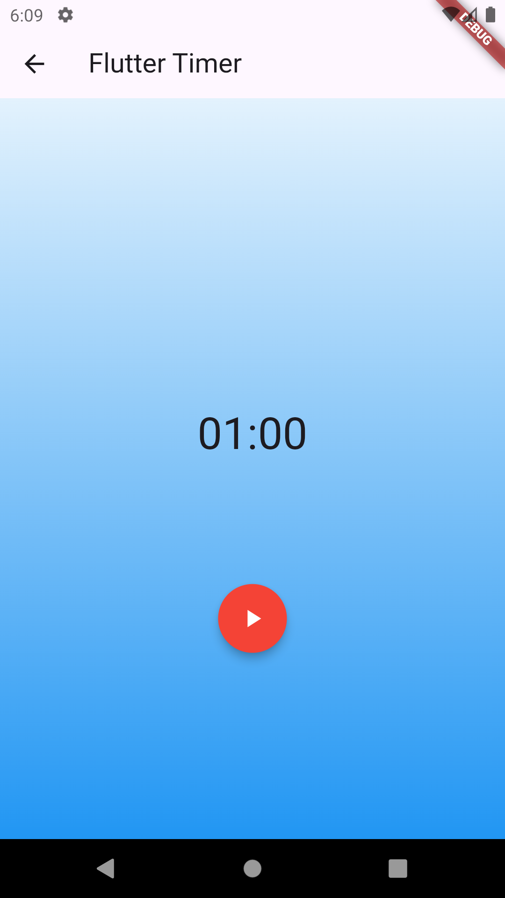
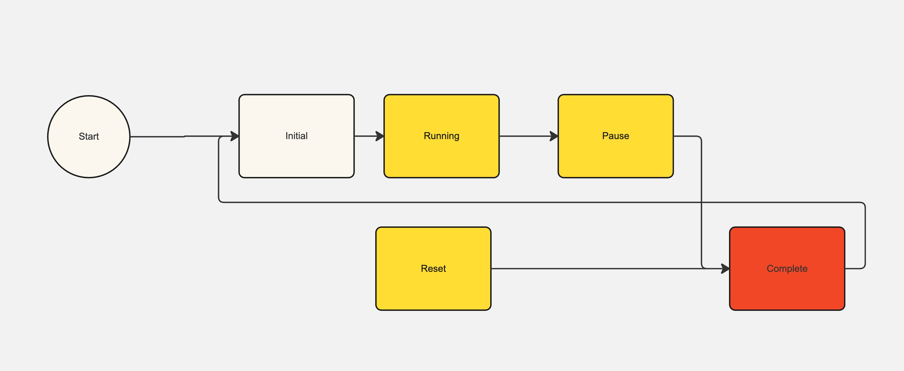

# cloud

Cloud is a public repo which describe the how to use multi-language and bloc library   in your flutter app 

### In the Bloc counter example we are dealing with 4 things.

- Cubit : Cubit is responsible to increase the state by 1 (+1 emit ) or vice versa (-1 emit) . Cubit informs the current state to the Bloc Observer and Bloc Builder.
- Bloc Observer : Bloc observer is observing the state of Cubit, whether it increases or decreases.
- Bloc Provider : Bloc provider is responsible to provide the access to their child widget.
- Bloc Builder : Bloc builder is a kind of stateful widget which updates the states of Cubit in the UI. 

### In Bloc Timer  we are dealing with 
- Ticker Period Streaming : It will work for the sp duration (60 sec).In the interval of 1 sec. 
- Bloc : It handle the events and states send and received from the UI
- Bloc event : This example have play | pause | reset events
- Bloc States : Initial state | Run and Pause State | Run in progress State | Complete State 
- Equatable : It is a utility to compare two objects.
- part of : sub-part of part
- part : main part.

### Flow of Timer States and events 

1. Start the time (come to the timer page )
2. Initial state (click on the start button)
3. When  you start the timer you will reach to running state and count down will start from (1:00 to 0:59....0:00)
4. At this point either you can reset the count down or pause the count down.
5. If you will not pause the count down it will reached to complete. 

