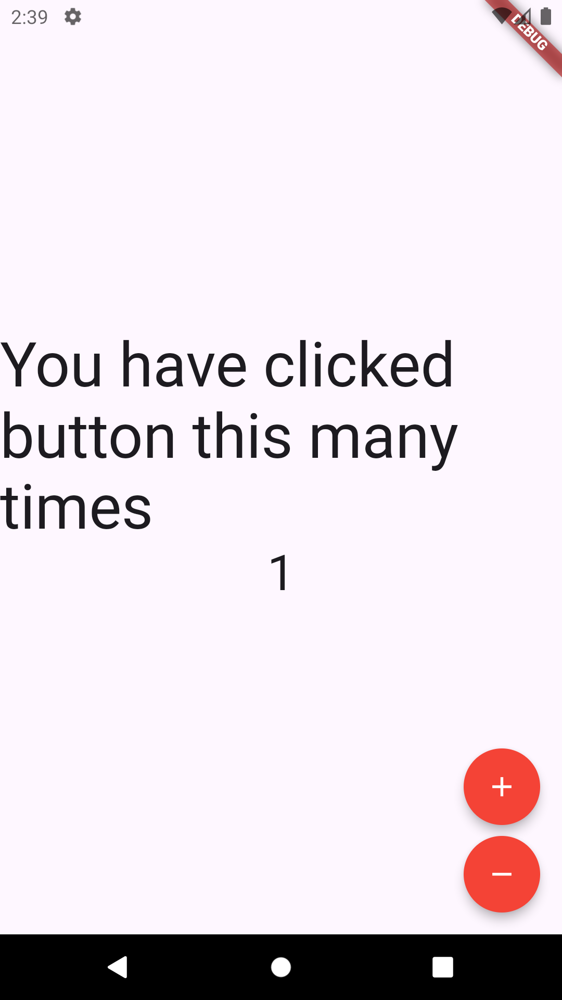

# cloud

Cloud is a public repo which describe the how to use multi-language and bloc library   in your flutter app 

### In the Bloc counter example we are dealing with 4 things.

- Cubit : Cubit is responsible to increase the state by 1 (+1 emit ) or vice versa (-1 emit) . Cubit informs the current state to the Bloc Observer and Bloc Builder.
- Bloc Observer : Bloc observer is observing the state of Cubit, whether it increases or decreases.
- Bloc Provider : Bloc provider is responsible to provide the access to their child widget.
- Bloc Builder : Bloc builder is a kind of stateful widget which updates the states of Cubit in the UI. 

